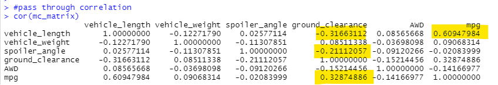
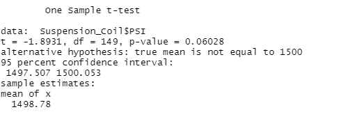
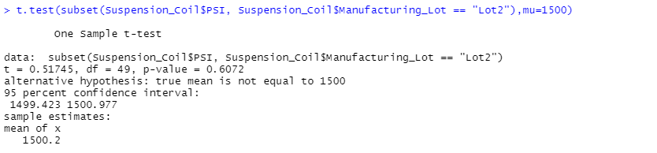

# MechaCar_Statistical_Analysis

## Linear Regression to Predict MPG

 

**D1.1** *Because there were 6 columns of data to look at, I created a matrix to see correlation*

 

**D1.2** *Linear model on data from data table from the csv*

 

**D1.3** *Summary of data. Primarily looking at P values lcoated in last column*

- **Which variables/coefficients provided a non-random amount of variance to the mpg values in the dataset?**
- - Looking at D1.3, vehicle length has a p value of 2.60e-12 and ground_clearance has a p value of 5.21e-08 suggesting there is a correlation and we must reject the null hypothesis that there is no correlation.
- **Is the slope of the linear model considered to be zero? Why or why not?**
- - For vehicle_length the slope shows as 6.267e+00 and ground_clearance's slope is 3.546e+00. These are significant positive slopes in comparison with the other values and were proven correlated before.
- **Does this linear model predict mpg of MechaCar prototypes effectively? Why or why not?**
- - On D1.3 we can see the r-squared value is 0.7146 and the adjusted value is 0.6825. If we use the non-adjusted r-squared value, this is above 0.7 suggesting a strong correlation. If we use the adjusted r-squared value this is under the 0.7 but above the 0.5 value and shows as a moderate correlation. 

## Summary Statistics on Suspension Coils
 

**D2.1** *Total summary of all lots PSI values*

 

**D2.2** *Lot Summary of each individual lot PSI values*

- **Does the current manufacturing data meet this design specification for all manufacturing lots in total and each lot individually? Why or why not?**
- - Looking at D2.1 for all lots, the mean is below 1500 which is the median suggesting that it is left skewed. The standard deviation is over 7, almost 8, which is very high.  It does not meet the specification if the mean is at 1498.78 and the deviation is slow low, as this suggests there are signficantly lower PSIs for the suspension coils. 

- - Looking at D2.2 for the individual lots, the mean for lot 1 and lot 2 are at 1500 which matches the median. Lot 2 does have a mean that is slightly over, suggesting it may be skewed to the right, but it is very small and it has a standard devoatopn of 2.73 which is a bit higher than expected but with both the mean and median at or above 1500, it would be meeting the minimum requirement of 1500 . Lot 3 is 1496.14 which is less than the median of 1498.5 suggesting it is skewed left. The mean and median are both under 1500 and that lot is not meeting the specification and the standard deviatio is 13 which is really high showing there is a wide range of values.

## T-Tests on Suspension Coils

 

**D3.1** *T-test for PSI across all lots*
- The p-value is 1 suggesting there is low significance. 
- DF=149
- The t-value is 0.
- The mean of x is 1498.78.
- 95 % is within 1497.507 - 1500.053 confidence interval.

 

**D3.2** *T-test for PSI across lot 1*
- The p-value is 1.568e-11 which is much smaller than 5 suggesting a extreme significance. 
- DF=49
- The t-value is 8.7161
- The mean of x is 1500.
- 95 % is within 1499.719 - 1500.281 confidence interval.

 

**D3.3** *T-test for PSI across lot 2*
- The p-value is 0.0005911 suggesting a very high signficance.
- DF=49
- The t-value is 3.6739.
- The mean of x is 1500.2.
- 95 % is within 1499.423 - 1500.977 confidence interval.

 

**D3.4** *T-test for PSI across lot 3*
- The p-value is 0.1589 suggesting low significance.
- DF=49
- The t-value is -1.4305.
- The mean of x is 1496.14.
- 95 % is within 1492.431 - 1499.849 confidence interval suggesting 95% values plus whatever is the to the left is under 1500.

## Study Design: MechaCar vs Competition
- **1. Metrics the consumers would care about**
- - Cost
- - MPG in streets and highway
- - Horse Power
- - Safety Ratings
- - **Metrics to test**

- - **2. Null Hypothesis**
    There is no significant difference between specific metric of MechaCars vs the competition.
- - **Alternative Hypothesis**
    There is a significant difference between specific metric of MechaCars vs the competition.

- - **3. Statistical Tests**
    We can use multiple linear regression to compare the continuous values like cost, mpg for streets and highway, and horse power and see any correlation.
    We can also perform T-tests between all cars as the population, and compare each competitor or MechaCars against the population.

- - **4. Data**
    - Ideally we would have information such as type of car (sedan, truck, etc. as these are common ways to look at values)
    - Cost, mpg on streets, mpg on highway, overall mpg, horse power, and safety ratings values.
    - We would need to calculate the mean, median, standard deviation, for each type and perhaps have an overall type of car as well and determine p-value, t-values, info for the regresion line like slope and intercept.
